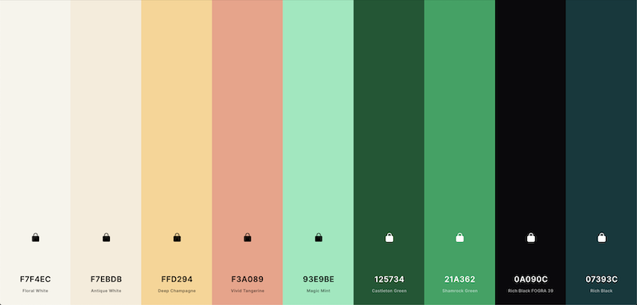
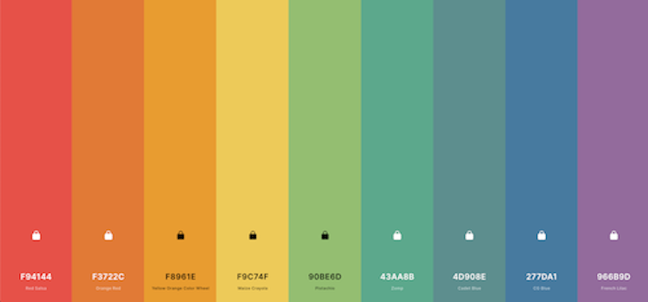
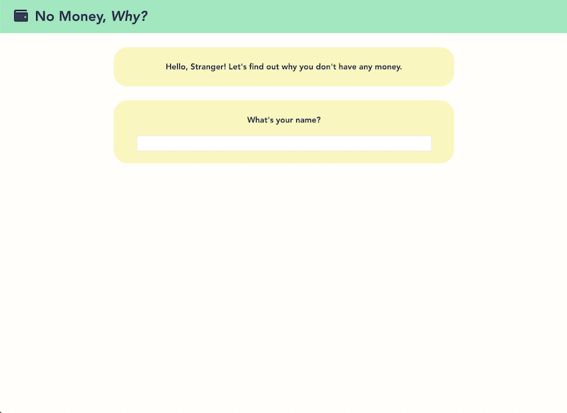
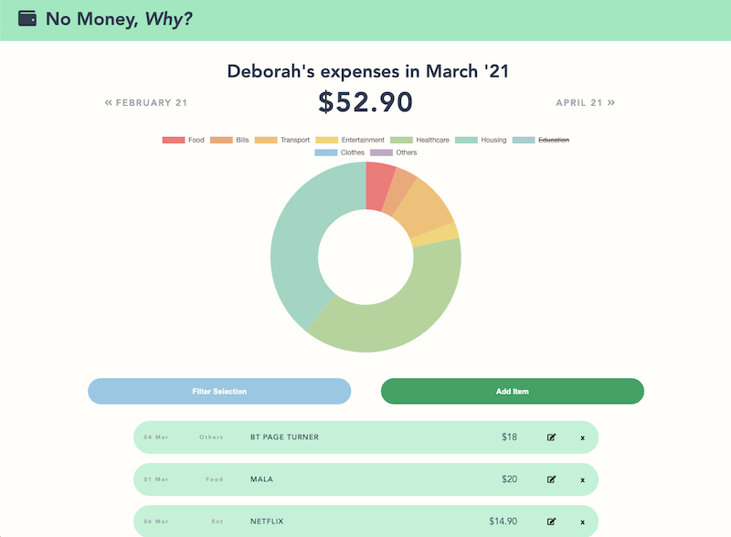
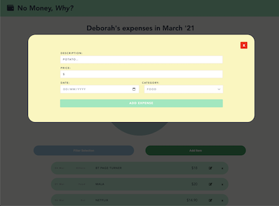
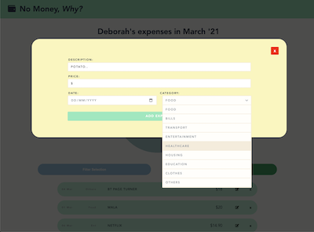
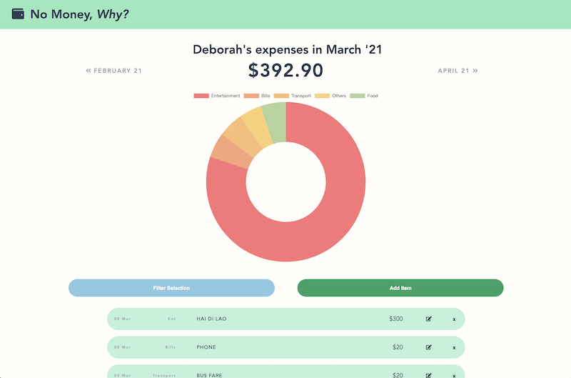

# No Money, Why? - Expense Tracker

Single page Expense Tracker that tells you why you suddenly have no more money.

## Contents

1. [Tech Used](#tech)

###  Tech Used

- Vue.js 3
- SCSS
- Font Awesome Icons

### Planning & Development Process

#### User Stories

Stage one of planning for development of any application is always getting user stories. Placing yourself in the user's shoes helps determine what kind of functionality the application needs.

In the case of the expense tracker, users should be able to:

- See total current expenditure for the month (or filter to a specific month)
- Add expenses. Expenses should have (minimally):
  - description
  - date
  - category
- Edit expenses
- Delete expenses
- See list of current expenses
- See visualisation of percentage of money spent on a specific category for specified month
  - see total amount spent on specific category for specified month

#### Designing

Since this was my first time using Vue, I spent a lot of time researching data visualisation libraries, then conceptualizing a rough layout _Which I would rather not share because I think I'm the only one who understands my sketch/gibberish_. Of course I spent a bit of time figuring out the basics of Vue as well.

After doing a rough sketch, I usually pick a colour theme. Since this app is about tracking money, I did a bit of research, checking out good colours for banking apps/expense trackers. I found most of them to contain rather bright, welcoming colours, that pop off the page.

I figured since we're dealing with money, just choose a green-based theme. Headed to my go-to [colour palette generator](https://coolors.com/generate) and started fiddling. This is what I ended up with:

One more for the graphs:

After getting my colour schemes together and choosing a nice data visualization library, I got to work.

No backend was used. All data was stored on local storage.

## SUMMARY

### Wins

- My app looks decent!
- Got core features to work (except the data visualisation)

#### Check out some screen grabs of the app:

New user registration

Dashboard

Adding Expenses

_UPDATE_ As of Mar 8, 3.07PM
I managed to get my charts to rerender when new items were added. But the hover is buggy.

### Challenges

- Getting familiar with Vue in one week
- Not using Vue 2? _mistakes were made my charts could have worked with less effort **I think**_
- Keeping my code clean
  - Was too focused on trying to get things to work and may have neglected the DRY rule

##### Data Visualisation

I actually had a lot of problems with this. There were many wrapper libraries not compatible with Vue 3, so after trying a few, I tried to make it reactive, but I didn't manage to do so. So my charts are still not reactive ):

### Furthers/Todos

- Add filter selection functionality
- Fix graph hover bug
- Find better way to sort expenses by dates
- Add budget/income section
- Connect to Firebase?
- Find better way to refactor files for better application performance
- see expenditure on specific day, range of dates, month, year
- Let user choose change chart visualisation type
- Let users add new categories
- _**REFACTOR AND OPTIMIZE EVERYTHING**_

### Reflections

I've learnt a lot. Like perhaps it's a good idea to check the compatibility of your favourite libraries before choosing what version of anything to work with!

Also proud of myself for taking on the challenge of using a new framework in such a short timeframe.
I definitely want to reach a point where I can think about how to refactor my code and organise my project better. Not gonna lie - it's in a terrible mess now. Just like my sleep-deprived brain.

Will do better next time!
